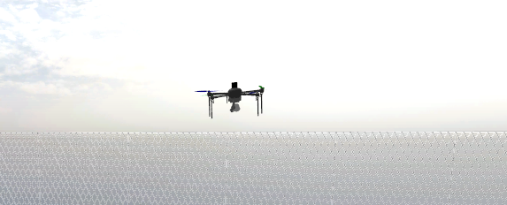
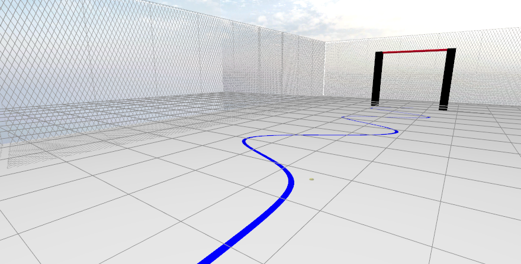

# Autonomous Line-Following Drone (ROS 2 / MAVROS)

> A ROS 2 project for an autonomous drone that performs vision-based navigation, line-following, and precision-target centering in a Gazebo simulation.

This project uses a Dockerized environment to run a complete PX4/ArduPilot SITL simulation with Gazebo, MAVROS, and OpenCV. The drone performs a multi-stage mission controlled by a robust state machine.

## 🎯 The Mission & Scope

This project serves as the **Final Challenge for the AVANT Electronics Trainee Program**.

The primary objective is to design, implement, and demonstrate a fully autonomous drone system capable of navigating a custom-built environment using only its onboard camera. The mission requires the drone to perform a complex sequence of visual navigation, path following, and precision target maneuvering.

### Mission Phases

The project scope is broken down into the following autonomous phases, which correspond directly to the `drone_mission_node` state machine:

1.  **Autonomous Takeoff & Staging:** The drone arms, takes off to a predefined altitude, and navigates to the start of the visual track (`START_POS_X`, `START_POS_Y`).
2.  **Visual Line Following:** The drone identifies a **blue line** on the floor. It then follows this line's path by making real-time lateral corrections (strafing) based on visual error from its camera feed.
3.  **Target Detection:** While following the line, the system actively scans for a **red crossbar**, which signals the end of the path.
4.  **Precision Centering:** Upon detecting the crossbar, the drone transitions from line-following to a precision centering mode. It uses a separate control logic to adjust its X and Y position, compensating for camera parallax, until it is perfectly centered over the target.
5.  **Station Keeping:** Once the centering error is within tolerance, the drone stops all horizontal movement and holds its position (hovers) over the target to signify mission completion.

### The Vehicle & Environment

This mission is conducted entirely in the provided Gazebo simulation environment.

 


---

## 🚀 Quick Start & Execution

This project is designed to run entirely within a Docker container. All dependencies are pre-installed in the provided image.

### 1. Prerequisites

You only need two things installed on your **host machine**:
* Linux OS (Ubuntu 22.04 recommended)
* [Docker Engine](https://docs.docker.com/engine/install/)

### 2. Setup

**Step 1: Get the Docker Image**
Pull the pre-built ROS 2 Humble simulation environment. This image contains Ubuntu 22.04, ROS 2, MAVROS, PX4-SITL, and all necessary dependencies.

```bash
docker pull joao0607/desafiofinal2025
```

**Step 2: Create the Container**
You must create a container based on the image you just downloaded; this will be your isolated environment where all the necessary dependencies will already be installed.

```bash
docker run -it \
--name mission_ws \
--privileged \
-e DISPLAY=$DISPLAY \
-e XDG_RUNTIME_DIR=$XDG_RUNTIME_DIR \
-e QT_X11_NO_MITSHM=1 \
-v /tmp/.X11-unix:/tmp/.X11-unix:rw \
--net=host \
joao0607/desafiofinal2025
```

**Step 3: Getting the ROS2 Workspace**
After running Step 2, you will be inside the container's terminal. Now, clone this repository (which contains all the necessary files) inside the container.

```bash
git clone https://github.com/bernardo-sabino/avant-finalproject.git
```

**Step 4: Run the Installation Script**
This one-time script will automatically install all dependencies, patch the MAVROS configuration, copy the packages into the ardu_ws, and compile the entire workspace.

```bash
cd avant-finalproject/
chmod +x install_mission.sh
./install_mission.sh
```

**Step 5: Run the Simulation**
After the script finishes, the environment is ready. You can now run the main simulation launch script.

```bash
source /home/rosuser/ardu_ws/install/setup.bash
cd home/rosuser/ardu_ws/Startup
./start.sh
```

The Gazebo simulation will now launch, and the drone will begin its mission automatically.

---
## 📦 Hardware Actuator Node (`vant_actuator_pkg`)

In addition to the Gazebo simulation, this project includes a third ROS 2 node, `vant_actuator_pkg`, which is responsible for the **physical hardware actuation** of the hook mechanism.

### Scope and Logic

* **Node:** `actuator_node` 
* **Purpose:** To listen for the `/drone_centered` topic (published by the `drone_mission_node`) and trigger the release of the hook.
* **Hardware Interface:** This node is designed to run on the **Jetson Orin Nano** and uses the `RPi.GPIO` library to send a signal to **Pin 7**, activating the relay circuit and disengaging the electromagnet.

### ❗️ Important: Simulation vs. Real-World

This package is **hardware-specific** and is **not intended to be run within the x86 Docker simulation**.

The `RPi.GPIO` library can only be compiled and executed on an **ARM-based** processor (like the Jetson). The `colcon build` process will fail inside the x86 Docker container if this dependency is active.

**For Simulation (In Docker):**
The `vant_actuator_pkg` should **not** be built or launched. The `drone_mission_node` will still publish the `/drone_centered` message, but it will simply be ignored, and the drone will complete its mission by hovering.

---

## 📄 License

This project is licensed under the MIT License. See the [LICENSE](LICENSE) file for full details.